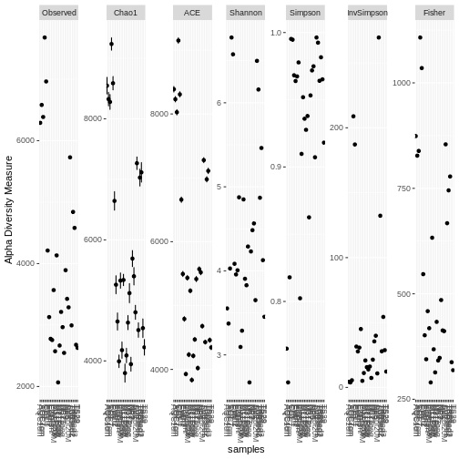
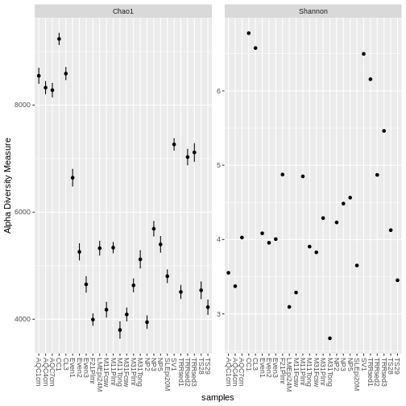
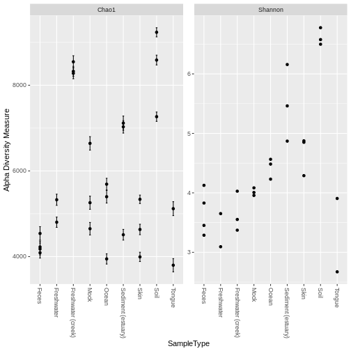
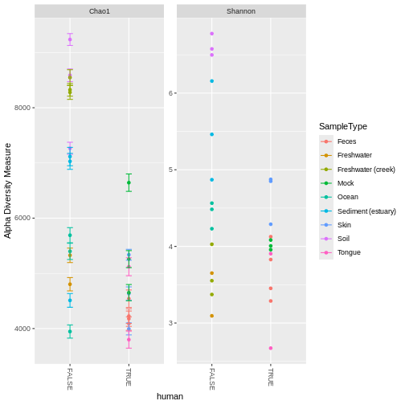
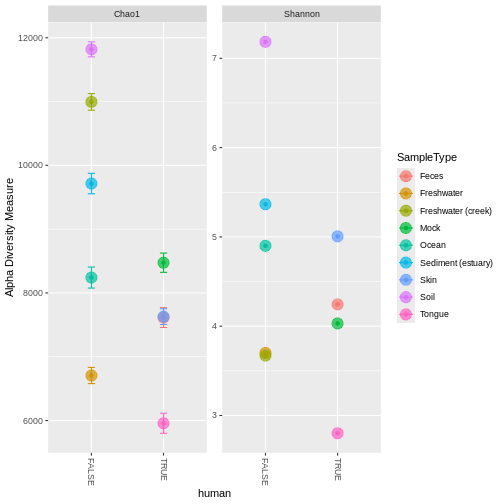
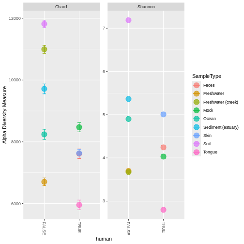

In this example we will explore some bioconductor packages for the analysis of microbiome data. We will focus on managing and storing data in a structures and reproducible way and then fine tune some visualizations. We will follow on with a similar set on analysis in the next session for [communicating & reproducing analysis]()

During this we will be making use of two main packages from the bioconductor library:

- [*Microbiome*](https://www.bioconductor.org/packages/release/bioc/html/microbiome.html)
- [*Phyloseq*](https://www.bioconductor.org/packages/release/bioc/html/phyloseq.html)

We will also introduce a new data class - `phyloseq-class` from the package [*Phyloseq*](https://joey711.github.io/phyloseq/) that uses the S4 class system.

> The [*Phyloseq*](https://www.bioconductor.org/packages/release/bioc/html/phyloseq.html) package is designed to store and manage phylogenetic sequencing data, including abundance data, phylogenetic trees, taxonomic assignments, and sample metadata, within a single experiment-level S4 object. This S4 object-oriented approach provides a structured and organized way to handle complex microbiome data, facilitating reproducible analyses and data sharing.

At its core is the `phyloseq-class` object, which integrates multiple data types: OTU/ASV tables, taxonomic annotations, sample metadata, and phylogenetic trees.
While originally developed for 16S rRNA microbiome studies, phyloseq-class objects are also widely used in:
 
 - eDNA metabarcoding studies (e.g., biodiversity monitoring in aquatic or terrestrial environments)
- Fungal ITS sequencing projects
- Metagenomic and metatranscriptomic datasets with annotated taxonomic profiles
- Environmental genomics and ecological community profiling

## Install packages

Install our [*Microbiome*](https://www.bioconductor.org/packages/release/bioc/html/microbiome.html) and [*Phyloseq*](https://www.bioconductor.org/packages/release/bioc/html/phyloseq.html) packages using `BiocManager::install()`


``` r
if (!require("BiocManager", quietly = TRUE))
    install.packages("BiocManager")

# The following initializes usage of Bioc devel
BiocManager::install(version='devel')

BiocManager::install("phyloseq")
BiocManager::install("microbiome")
```


Now load in the packages we need for this analysis

``` r
library(microbiome)
library(phyloseq)
library(knitr)
```

## Example datasets

We will explore some example datasets that come with the packages [Microbiome*](https://microbiome.github.io/tutorials/Data.html) and [*Phyloseq*](https://joey711.github.io/phyloseq/Example-Data). We will take some time to explore what information they contain, how we can view the datasets and how they differ.

**Explore dataset 1 - `dietswap`**

The first dataset we will load is from [O'Keefe S et al. Nature Communications, 2015](https://dx.doi.org/10.1038/ncomms7342) made available by [*Microbiome*](https://microbiome.github.io/tutorials/Data.html) package. This study 
contains microbiome data from a study with African and African American groups undergoing a two-week diet swap. This data set is based on the Human Intestinal Tract (HIT)Chip phylogenetic 16S microarray ([Rajilic-Stojanovic et al. 2009](https://doi.org/10.1111/j.1462-2920.2009.01900.x)). This profiling technology differs from the more widely used 16S rRNA amplicon sequencing. Column metadata includes the subject identifier, sex, nationality, group information, sample identifier, time point information, time point information within group and BMI group. Row metadata contains taxonomic information on the Phylum, Family and Genus level.


``` r
data(dietswap)
```

**Explore dataset 2 - `peerj32`**

The second dataset we will load is the `peerj32` data from [Lahti et al. PeerJ 1:e32, 2013](https://doi.org/10.7717/peerj.32) made available by [*Microbiome*](https://microbiome.github.io/tutorials/Data.html) package. This characterizes associations between human intestinal microbiota and blood serum lipids. Note that this data set contains an additional data matrix of lipid species. 


``` r
data(peerj32)
```

**Explore dataset 3 - `GlobalPatterns`**

The third dataset we will load is the `GlobalPatterns` data from [Caporaso et al. PNAS, 108, 4516-4522, 2011](https://doi.org/10.1073/pnas.1000080107) made available by [*Phyloseq*](https://joey711.github.io/phyloseq/Example-Data). This work compared the microbial communities from 25 environmental samples and three known "mock communities" -- a total of 9 sample types -- at a depth averaging 3.1 million reads per sample. Authors were able to reproduce diversity patterns seen in many other published studies, while also investigating technical issues/bias by applying the same techniques to simulated microbial communities of known composition.


``` r
data(GlobalPatterns)
```

:::::::::::::::::::::::::::::::::::::::  challenge

### Exploring data

Explore the datasets `dietswap`, `peerj32` and `GlobalPatterns` that you just loaded. You can do this by navigating to your "Environment" pane, or in the console try the following `dietswap@` and see what options are available to you. Can you view the metadata for this data set? Why does `peerj32@` not work in the same way? 

:::::::::::::::  solution

### Solution

To see the full data within the `peerj32` object try typing `peerj32$` into the console. 

:::::::::::::::::::::::::

::::::::::::::::::::::::::::::::::::::::::::::::::

:::::::::::::::::::::::::::::::::::::::  challenge

### Missing information

Can you identify what information is missing in each of the three `phyloseq-class` objects for the datasets above?

:::::::::::::::  solution

### Solution

Check the contents of each of the three datasets separately and you can see that both `dietswap` and `peerj32$phyloseq` objects only contain the minimum data required - `otu_table()`, `sample_data()` and `tax_table()`.
The `GlobalPatterns` data also contained additional taxonomic ranks and `phy_tree()` which is a phylogenetic tree that we can use when performing analysis. 

```r
> dietswap
phyloseq-class experiment-level object
otu_table()   OTU Table:         [ 130 taxa and 222 samples ]
sample_data() Sample Data:       [ 222 samples by 8 sample variables ]
tax_table()   Taxonomy Table:    [ 130 taxa by 3 taxonomic ranks ]
```

```r
> peerj32$phyloseq
phyloseq-class experiment-level object
otu_table()   OTU Table:         [ 130 taxa and 44 samples ]
sample_data() Sample Data:       [ 44 samples by 5 sample variables ]
tax_table()   Taxonomy Table:    [ 130 taxa by 3 taxonomic ranks ]
```

```r
> GlobalPatterns
phyloseq-class experiment-level object
otu_table()   OTU Table:         [ 19216 taxa and 26 samples ]
sample_data() Sample Data:       [ 26 samples by 7 sample variables ]
tax_table()   Taxonomy Table:    [ 19216 taxa by 7 taxonomic ranks ]
phy_tree()    Phylogenetic Tree: [ 19216 tips and 19215 internal nodes ]
```

:::::::::::::::::::::::::

::::::::::::::::::::::::::::::::::::::::::::::::::


## Visualising data

Now we will have a go at working through some data visualizations and improving asesthetics ready for publications or sharing with colleagues.

For this exercise we will work through using the `GlobalPatterns` data. 

>The `GlobalPatterns` data is from [Caporaso et al. PNAS, 108, 4516-4522, 2011](https://doi.org/10.1073/pnas.1000080107) made available by [*Phyloseq*](https://joey711.github.io/phyloseq/Example-Data). This work compared the microbial communities from 25 environmental samples and three known "mock communities"

First a re-fresh of what the sample data contains for this dataset


``` r
GlobalPatterns@sam_data
```

``` output
Sample Data:        [26 samples by 7 sample variables]:
         X.SampleID  Primer Final_Barcode Barcode_truncated_plus_T
CL3             CL3 ILBC_01        AACGCA                   TGCGTT
CC1             CC1 ILBC_02        AACTCG                   CGAGTT
SV1             SV1 ILBC_03        AACTGT                   ACAGTT
M31Fcsw     M31Fcsw ILBC_04        AAGAGA                   TCTCTT
M11Fcsw     M11Fcsw ILBC_05        AAGCTG                   CAGCTT
M31Plmr     M31Plmr ILBC_07        AATCGT                   ACGATT
M11Plmr     M11Plmr ILBC_08        ACACAC                   GTGTGT
F21Plmr     F21Plmr ILBC_09        ACACAT                   ATGTGT
M31Tong     M31Tong ILBC_10        ACACGA                   TCGTGT
M11Tong     M11Tong ILBC_11        ACACGG                   CCGTGT
LMEpi24M   LMEpi24M ILBC_13        ACACTG                   CAGTGT
SLEpi20M   SLEpi20M ILBC_15        ACAGAG                   CTCTGT
AQC1cm       AQC1cm ILBC_16        ACAGCA                   TGCTGT
AQC4cm       AQC4cm ILBC_17        ACAGCT                   AGCTGT
AQC7cm       AQC7cm ILBC_18        ACAGTG                   CACTGT
NP2             NP2 ILBC_19        ACAGTT                   AACTGT
NP3             NP3 ILBC_20        ACATCA                   TGATGT
NP5             NP5 ILBC_21        ACATGA                   TCATGT
TRRsed1     TRRsed1 ILBC_22        ACATGT                   ACATGT
TRRsed2     TRRsed2 ILBC_23        ACATTC                   GAATGT
TRRsed3     TRRsed3 ILBC_24        ACCACA                   TGTGGT
TS28           TS28 ILBC_25        ACCAGA                   TCTGGT
TS29           TS29 ILBC_26        ACCAGC                   GCTGGT
Even1         Even1 ILBC_27        ACCGCA                   TGCGGT
Even2         Even2 ILBC_28        ACCTCG                   CGAGGT
Even3         Even3 ILBC_29        ACCTGT                   ACAGGT
         Barcode_full_length         SampleType
CL3              CTAGCGTGCGT               Soil
CC1              CATCGACGAGT               Soil
SV1              GTACGCACAGT               Soil
M31Fcsw          TCGACATCTCT              Feces
M11Fcsw          CGACTGCAGCT              Feces
M31Plmr          CGAGTCACGAT               Skin
M11Plmr          GCCATAGTGTG               Skin
F21Plmr          GTAGACATGTG               Skin
M31Tong          TGTGGCTCGTG             Tongue
M11Tong          TAGACACCGTG             Tongue
LMEpi24M         CATGAACAGTG         Freshwater
SLEpi20M         AGCCGACTCTG         Freshwater
AQC1cm           GACCACTGCTG Freshwater (creek)
AQC4cm           CAAGCTAGCTG Freshwater (creek)
AQC7cm           ATGAAGCACTG Freshwater (creek)
NP2              TCGCGCAACTG              Ocean
NP3              GCTAAGTGATG              Ocean
NP5              GAACGATCATG              Ocean
TRRsed1          CACGTGACATG Sediment (estuary)
TRRsed2          TGCGCTGAATG Sediment (estuary)
TRRsed3          GATGTATGTGG Sediment (estuary)
TS28             GCATCGTCTGG              Feces
TS29             CTAGTCGCTGG              Feces
Even1            TGACTCTGCGG               Mock
Even2            TCTGATCGAGG               Mock
Even3            AGAGAGACAGG               Mock
                                          Description
CL3          Calhoun South Carolina Pine soil, pH 4.9
CC1          Cedar Creek Minnesota, grassland, pH 6.1
SV1        Sevilleta new Mexico, desert scrub, pH 8.3
M31Fcsw       M3, Day 1, fecal swab, whole body study
M11Fcsw      M1, Day 1, fecal swab, whole body study 
M31Plmr       M3, Day 1, right palm, whole body study
M11Plmr      M1, Day 1, right palm, whole body study 
F21Plmr     F1, Day 1,  right palm, whole body study 
M31Tong          M3, Day 1, tongue, whole body study 
M11Tong          M1, Day 1, tongue, whole body study 
LMEpi24M Lake Mendota Minnesota, 24 meter epilimnion 
SLEpi20M Sparkling Lake Wisconsin, 20 meter eplimnion
AQC1cm                   Allequash Creek, 0-1cm depth
AQC4cm                  Allequash Creek, 3-4 cm depth
AQC7cm                  Allequash Creek, 6-7 cm depth
NP2            Newport Pier, CA surface water, Time 1
NP3            Newport Pier, CA surface water, Time 2
NP5            Newport Pier, CA surface water, Time 3
TRRsed1                Tijuana River Reserve, depth 1
TRRsed2                Tijuana River Reserve, depth 2
TRRsed3                Tijuana River Reserve, depth 2
TS28                                          Twin #1
TS29                                          Twin #2
Even1                                           Even1
Even2                                           Even2
Even3                                           Even3
```

Next we often need to do some data pruning or subsetting. In this case we are making sure we remove taxa that doesn't have any sequences present.


``` r
GP <- prune_species(speciesSums(GlobalPatterns) > 0, GlobalPatterns)
```

``` warning
Warning in prune_species(speciesSums(GlobalPatterns) > 0, GlobalPatterns): 'prune_species' is deprecated.
Use 'prune_taxa' instead.
See help("Deprecated") and help("phyloseq-deprecated").
```

``` warning
Warning in speciesSums(GlobalPatterns): 'speciesSums' is deprecated.
Use 'taxa_sums' instead.
See help("Deprecated") and help("phyloseq-deprecated").
```

``` r
# compare the two datasets
GlobalPatterns
```

``` output
phyloseq-class experiment-level object
otu_table()   OTU Table:         [ 19216 taxa and 26 samples ]
sample_data() Sample Data:       [ 26 samples by 7 sample variables ]
tax_table()   Taxonomy Table:    [ 19216 taxa by 7 taxonomic ranks ]
phy_tree()    Phylogenetic Tree: [ 19216 tips and 19215 internal nodes ]
```

``` r
GP
```

``` output
phyloseq-class experiment-level object
otu_table()   OTU Table:         [ 18988 taxa and 26 samples ]
sample_data() Sample Data:       [ 26 samples by 7 sample variables ]
tax_table()   Taxonomy Table:    [ 18988 taxa by 7 taxonomic ranks ]
phy_tree()    Phylogenetic Tree: [ 18988 tips and 18987 internal nodes ]
```

### Alpha diversity plots

For microbiome (or community analysis) a common strategy is to visualize the alpha diversity of samples. Essentially this is how many unique taxa were identified in each sample.

At the simplest level we can plot all the alpha diversity measures from the function `plot_richness()` from the [*Phyloseq*](https://www.bioconductor.org/packages/release/bioc/html/phyloseq.html) package. 


``` r
plot_richness(GP)
```

``` warning
Warning: `aes_string()` was deprecated in ggplot2 3.0.0.
ℹ Please use tidy evaluation idioms with `aes()`.
ℹ See also `vignette("ggplot2-in-packages")` for more information.
ℹ The deprecated feature was likely used in the phyloseq package.
  Please report the issue at <https://github.com/joey711/phyloseq/issues>.
This warning is displayed once every 8 hours.
Call `lifecycle::last_lifecycle_warnings()` to see where this warning was
generated.
```



Note that in this case, the Fisher calculation results in a warning (but still plots).

There is a lot going on here so let's try just look at two different alpha diversity measures.

We can avoid this by specifying a measures argument to plot_richness, which will include just the alpha-diversity measures that we want.


``` r
plot_richness(GP, measures=c("Chao1", "Shannon"))
```



:::::::::::::::::::::::::::::::::::::::::  callout

### Getting help on functions

You can find more information on the funciton by typing `?plot_richness` into the console. Have a look and see what measures are available using this function.

::::::::::::::::::::::::::::::::::::::::::::::::::

We can specify a sample variable on which to group/organize samples along the horizontal (`x`) axis. An experimentally meaningful categorical variable is usually a good choice – in this case, the "`SampleType`" variable works much better than attempting to interpret the sample names directly (as in the previous plot):


``` r
plot_richness(GP, x="SampleType", measures=c("Chao1", "Shannon"))
```



Now suppose we wanted to use an external variable in the plot that isn’t in the `GP` dataset already – for example, a logical that indicated whether or not the samples are human-associated. First, define this new variable, `human`, as a factor (other vectors could also work; or other data you might have describing the samples).


``` r
sampleData(GP)$human <- getVariable(GP, "SampleType") %in% 
  c("Feces", "Mock", "Skin", "Tongue")
```

``` warning
Warning in getVariable(GP, "SampleType"): 'getVariable' is deprecated.
Use 'get_variable' instead.
See help("Deprecated") and help("phyloseq-deprecated").
```

``` warning
Warning in sampleData(`*tmp*`): 'sampleData' is deprecated.
Use 'sample_data' instead.
See help("Deprecated") and help("phyloseq-deprecated").
```

``` warning
Warning in `sampleData<-`(`*tmp*`, value = new("sample_data", .Data = list(: 'sampleData<-' is deprecated.
Use 'sample_data<-' instead.
See help("Deprecated") and help("phyloseq-deprecated").
```

Now tell `plot_richness` to map the new human variable on the horizontal axis, and shade the points in different color groups, according to which "`SampleType`" they belong.


``` r
plot_richness(
  GP,
  x = "human",
  color = "SampleType",
  measures = c("Chao1", "Shannon")
)
```



We can merge samples that are from the environment (`SampleType`), and make the points bigger with a ggplot2 layer. First, merge the samples.


``` r
GPst <- merge_samples(GP, "SampleType")
# repair variables that were damaged during merge (coerced to numeric)
sample_data(GPst)$SampleType <- factor(sample_names(GPst))
sample_data(GPst)$human <- as.logical(sample_data(GPst)$human)
```

Now we can plot this environment-merged version of the data. First store the default ggplot graphic as `p`, then add an additional `geom_point` layer with a large size and slight transparency.


``` r
p <- plot_richness(
  GPst,
  x = "human",
  color = "SampleType",
  measures = c("Chao1", "Shannon")
)
p1 <- p + geom_point(size = 5, alpha = 0.7)
p1
```



**More details about ggplot2**

For those interested in why this works so concisely `(p + geom_point(size=4, alpha=0.7))`, it is because the rest of the aesthetic mapping and data are contained in the ggplot object, `p`, and so is inherited in the call to the ggplot2 geometric object layer function, `geom_point`, by default since we didn’t specify alternative `aes` or `data` arguments. Although we could have if we wanted to. This perhaps sounds more confusing than it is, and I find it easier to understand by inspecting the examples I’ve shown here.

You’ll also notice that the original smaller points are still on the plot. This is because they were the first layer, and our larger points are semi-transparent. I find this kind of distracting, and doesn’t add any information or clarity. The good news is that layers can be removed from a ggplot object with standard list notation (using the dollar sign `$`).

First, check which lists are present in `p`.


``` r
p$layers
```

``` output
$geom_point
geom_point: na.rm = TRUE
stat_identity: na.rm = TRUE
position_identity 

$geom_errorbar
mapping: ymax = ~value + se, ymin = ~value - se 
geom_errorbar: na.rm = FALSE, orientation = NA, lineend = butt, width = 0.1
stat_identity: na.rm = FALSE
position_identity 
```

We can see that the first layer is the one specifying the original points, which are small. We can use negative indexing to “pop” it out, then add a new `geom_point` layer with larger point size (the following two lines).


``` r
p$layers <- p$layers[-1]
p + geom_point(size=5, alpha=0.7)
```



### Phylogenetic trees

[](https://joey711.github.io/phyloseq/plot_tree-examples.html)


### Ordination plots

[](https://joey711.github.io/phyloseq/plot_ordination-examples.html)


---

:::::::::::::::::::::::::::::::::::::::: keypoints

- Bespoke often domain specific data classes are often built to serve a specific set of data, however by utilising fundamental R principals such as S4 class structures transferring formats between packages for analysis is much easier.
- Look for widely accepted data classes in your field before formatting your data for a specific package early on.
- Packages that generate [*ggplot2*](https://ggplot2.tidyverse.org/) compatible figures allow for *easier* manipulations and customise using familar syntax

::::::::::::::::::::::::::::::::::::::::::::::::::
